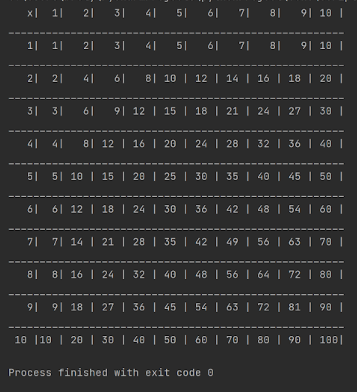

# Python Multiplication Table
This displays a multiplication table from 1 to 100.

# Implementation 
Open up the "CANVAS_LOOPS_MULTIPLICATION_TABLE.py" file with PyCharm or another Python IDE and run it to see the table. 

# Design Process
This was one of my first projects when I took C SCI 131 - Python at Highline College in Washington. The purpose of the project was to demonstrate the use of loops.

# The Future
Looking back on this now, it seems like such a simple project! I've come a long way.
